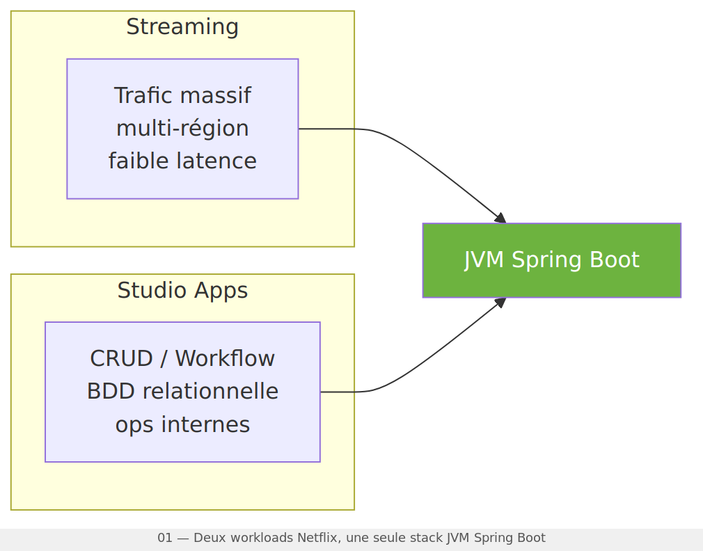
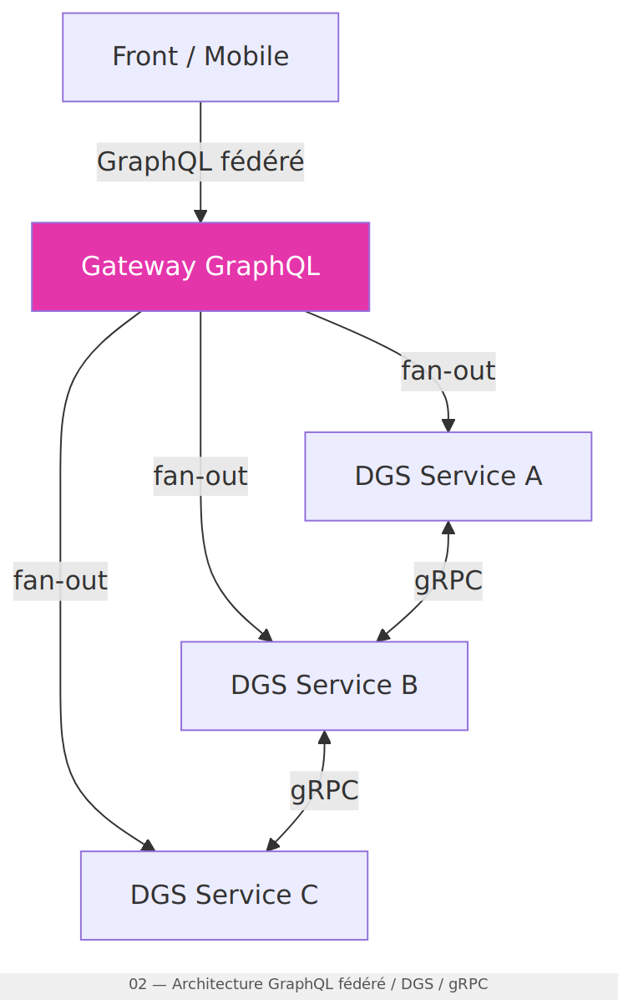
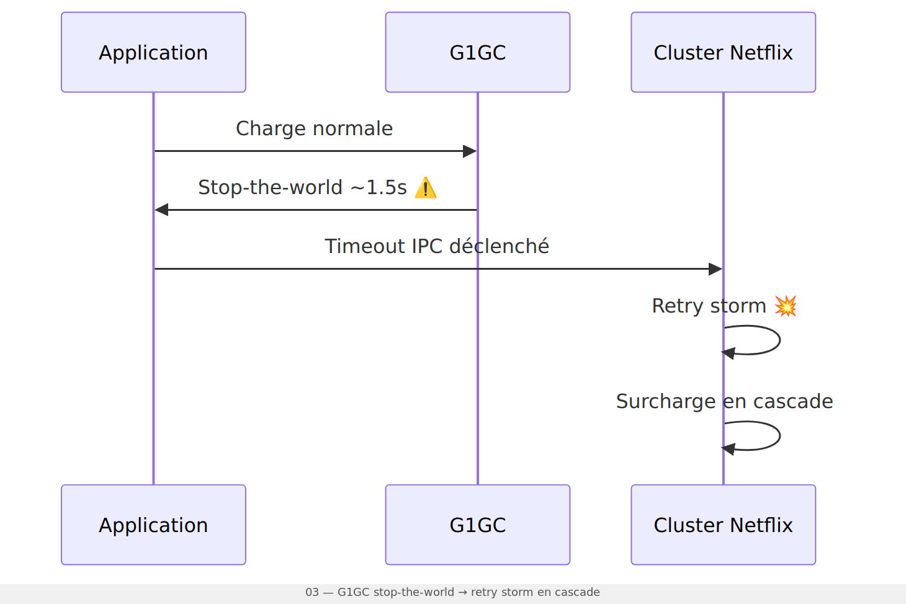
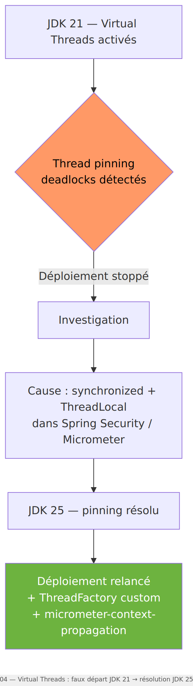
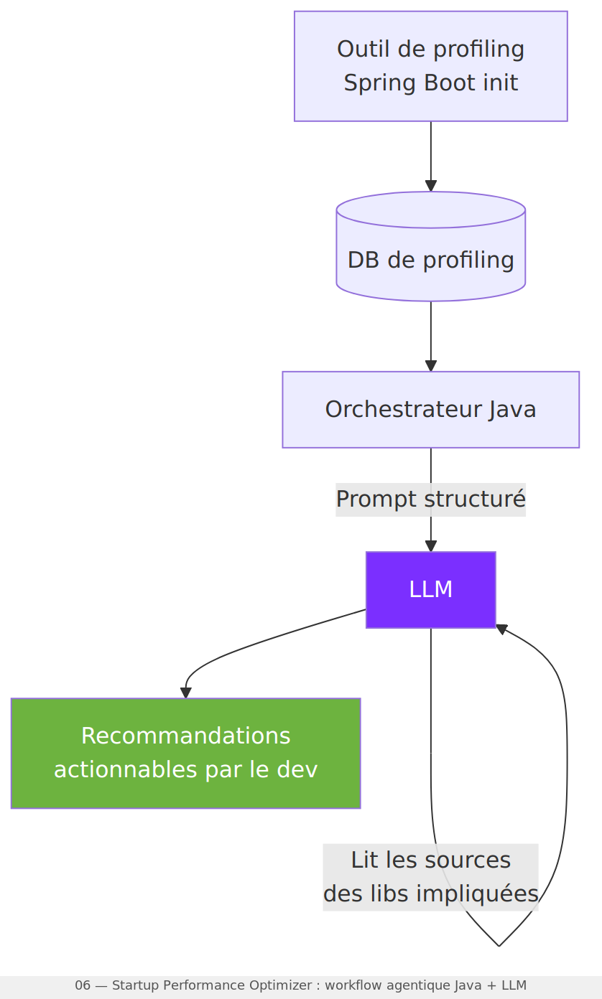

# ☕ How Netflix Uses Java — 2026 Edition

> TP issu de mes notes après avoir regardé la conférence **"How Netflix Uses Java — 2026 Edition"**
> par Paul — Java Platform Team @ Netflix (créateur du framework DGS).
>
> 🎥 [Voir la vidéo](https://www.youtube.com/watch?v=ucJTPda_zx0)

---

## Ce que ce module contient

Trois TPs qui valident concrètement les points les plus applicables de la conférence :

| Dossier | Sujet | Difficulté |
|---|---|---|
| `testslices/` | `@WebMvcTest` vs `@SpringBootTest` — benchmark temps | ⭐ |
| `virtualthreads/` | Reproduction bug ThreadLocal JDK 21 + fix `micrometer-context-propagation` | ⭐⭐ |
| `zgc/` | Config Generational ZGC commentée + bench GC pause | ⭐⭐ |

---

## Lancer les tests

```bash
# Tous les tests
mvn test

# Un TP spécifique
mvn test -Dtest="TestSlicesComparisonTest"
mvn test -Dtest="VirtualThreadsContextPropagationTest"
mvn test -Dtest="ZgcConfigTest"
```

---

## Résumé de l'article

### 1️⃣ Une seule stack pour tout

Netflix fait tourner entre 3 000 et 4 000 microservices Java en prod. Streaming temps réel multi-région ET applications internes "boring" de Netflix Studio → même JVM Spring Boot.

Ce n'est pas de la flemme de migrer. C'est un choix assumé : ça réduit la fragmentation des compétences, simplifie les recrutements, et évite de maintenir plusieurs cultures techniques en parallèle.

> *"La JVM n'est pas un héritage qu'on subit. C'est un choix qu'on assume."*



---

### 2️⃣ REST est (quasiment) mort chez Netflix

GraphQL fédéré pour les échanges front ↔ backend. gRPC pour les communications server-to-server. REST ne survit plus que pour les cas vraiment triviaux.

Les services s'appellent **DGS (Domain Graph Services)** — un framework open-source Netflix construit par-dessus Spring Boot. Un Gateway GraphQL fait le fan-out et agrège les réponses.

Ce qui m'a aussi frappé sur les tests : Netflix a abandonné `@SpringBootTest` au profit des **Test Slices** (`@WebMvcTest`, `@DataJpaTest`, `@EnableDgsTest`). Tests plus rapides, plus ciblés. Hâte de le tester en TP et de l'implémenter concrètement en mission — c'est exactement le genre de pattern qui change la vitesse des tests sans toucher à l'archi.

→ **TP : `src/test/java/.../testslices/`**



---

### 3️⃣ Generational ZGC — le GC qui a changé leur infra

Avec G1GC, les pauses stop-the-world atteignaient **~1,5 seconde**. Ça paraît peu. Mais à l'échelle Netflix, avec des timeouts IPC agressifs, chaque pause déclenchait une **retry storm** — une cascade de retries qui surchargeait tout le cluster.

Migration vers **Generational ZGC** → pauses à 0. Ça consomme plus de CPU, mais la disparition des retry storms a paradoxalement réduit la charge globale.

Sur Spring Boot 3+ avec Java 21 : `-XX:+UseZGC -XX:+ZGenerational` est disponible. Pas forcément utile sur une appli CRUD légère — mais à avoir en tête pour les discussions d'architecture sur des services à fort trafic.

→ **TP : `src/test/java/.../zgc/`**



---

### 4️⃣ Virtual Threads — attention, c'est pas magique

Netflix a tenté d'activer les Virtual Threads sur JDK 21. **Résultat : deadlocks en production, déploiement annulé.**

La cause : Spring Security et Micrometer utilisent des `ThreadLocal`. Lors d'un `StructuredTaskScope.fork()`, le contexte du thread parent n'est pas copié vers les virtual threads enfants. Couplé au thread pinning sur les blocs `synchronized` → deadlocks intermittents.

En JDK 25, le pinning est résolu. Mais la propagation de contexte reste à gérer via `micrometer-context-propagation`.

Morale : `spring.threads.virtual.enabled=true` ne s'active pas à l'aveugle si Spring Security est dans la boucle. Netflix l'a appris en prod — autant ne pas répéter l'expérience.

→ **TP : `src/test/java/.../virtualthreads/`**



---

### 5️⃣ Migrer 4 000 microservices avec des agents LLM

**SB2 → SB3** (migration Jakarta EE) : OpenRewrite + transformations Gradle sur le bytecode.

**SB3 → SB4** : agents LLM headless orchestrés en Java, avec checkpointing pour reprendre sur erreur.

Ce n'est pas du vibe coding. C'est de l'industrialisation sérieuse.


---

### 6️⃣ GenAI en Java — plus besoin de Python

> *"L'époque où l'IA était l'apanage exclusif de Python est révolue."* — Paul, Netflix

Netflix a construit un **Startup Performance Optimizer** : un orchestrateur Java envoie des prompts structurés à un LLM qui analyse les sources des libs impliquées et génère des recommandations actionnables.

Leur philosophie : le code Java orchestre. Le LLM ne fait que le routing des décisions complexes. Pas de boîte noire sur des systèmes critiques.

Outils disponibles dès aujourd'hui : **Spring AI** et **LangChain4j**.



---

## Références

- 📹 [How Netflix Uses Java — 2026 Edition](https://www.youtube.com/watch?v=ucJTPda_zx0)
- 📦 [Framework DGS — Netflix OSS](https://netflix.github.io/dgs/)
- 🔧 [OpenRewrite](https://docs.openrewrite.org/)
- 🌱 [Spring AI](https://spring.io/projects/spring-ai)
- ☕ [LangChain4j](https://github.com/langchain4j/langchain4j)